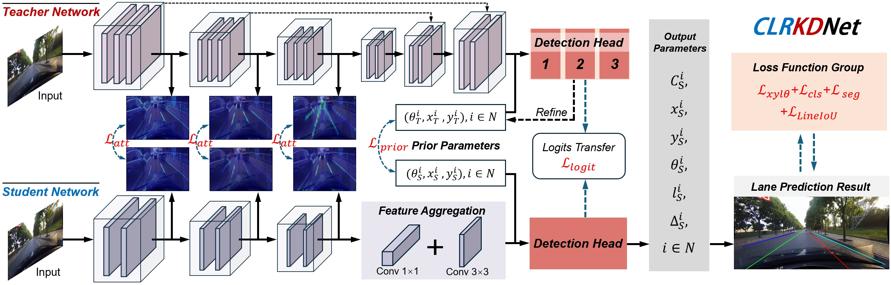
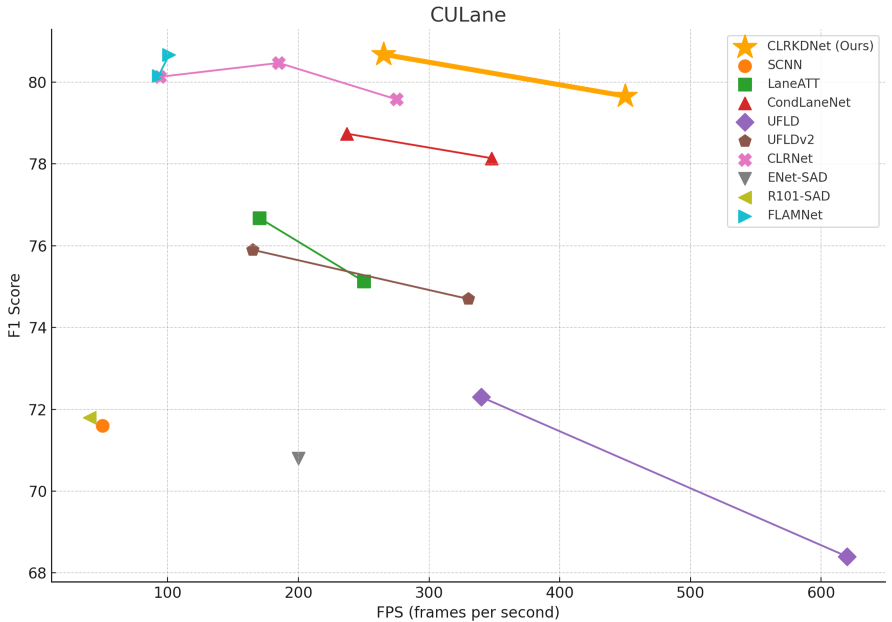

<div align="center">
  
[](https://paperswithcode.com/sota/lane-detection-on-culane?p=clrkdnet-speeding-up-lane-detection-with)

</div>


<div align="center">

# CLRKDNet: Speeding up Lane Detection with Knowledge Distillation

</div>

## Introduction


## Installation

### Prerequisites
Only test on Ubuntu18.04 and 20.04 with:
- Python >= 3.8 (tested with Python3.8)
- PyTorch >= 1.6 (tested with Pytorch1.6)
- CUDA (tested with cuda10.2)
- Other dependencies described in `requirements.txt`

### Create a conda virtual environment and activate it

```Shell
conda create -n clrkdnet python=3.8 -y
conda activate clrkdnet
```

### Install dependencies

```Shell
# Install pytorch firstly, the cudatoolkit version should be same in your system.

conda install pytorch torchvision cudatoolkit=10.1 -c pytorch

# Or you can install via pip
pip install torch==1.8.0 torchvision==0.9.0

# Install python packages
python setup.py build develop
```

### Data preparation

#### CULane
Download [CULane](https://xingangpan.github.io/projects/CULane.html). Then extract them to `$CULANEROOT`. Create link to `data` directory.

```Shell
cd $CLRKDNET_ROOT
mkdir -p data
ln -s $CULANEROOT data/CULane
```

For CULane, you should have structure like this:
```
$CULANEROOT/driver_xx_xxframe    # data folders x6
$CULANEROOT/laneseg_label_w16    # lane segmentation labels
$CULANEROOT/list                 # data lists
```


#### Tusimple
Download [Tusimple](https://github.com/TuSimple/tusimple-benchmark/issues/3). Then extract them to `$TUSIMPLEROOT`. Create link to `data` directory.

```Shell
cd $CLRKDNET_ROOT
mkdir -p data
ln -s $TUSIMPLEROOT data/tusimple
```

For Tusimple, you should have structure like this:
```
$TUSIMPLEROOT/clips # data folders
$TUSIMPLEROOT/lable_data_xxxx.json # label json file x4
$TUSIMPLEROOT/test_tasks_0627.json # test tasks json file
$TUSIMPLEROOT/test_label.json # test label json file

```

For Tusimple, the segmentation annotation is not provided, hence we need to generate segmentation from the json annotation. 

```Shell
python tools/generate_seg_tusimple.py --root $TUSIMPLEROOT
# this will generate seg_label directory
```

## Getting Started

[assets]: https://github.com/weiqingq/CLRKDNet/releases

### CULane

|   Backbone  | F1@50 | Log 
| :---  |  :---   |  :---:
| [ResNet-18][assets]     |  79.66  | [resnet18 log](https://github.com/weiqingq/CLRKDNet/releases/download/training_logs/resnet18_distill_log.txt)
| [DLA-34][assets]     |  80.68  | [dla34 log](https://github.com/weiqingq/CLRKDNet/releases/download/training_logs/dla34_distillation_log.txt)


### Train

To train CLRKDNet, ensure that you have the teacher model's weights (from CLRNet) and verify that the teacher model's configuration file matches the provided weights. Start training with the following command:
```Shell
python main.py [configs/path_to_your_config] --gpus [gpu_id] --distillation --teacher_model_cfg [teacher model config] --teacher_model_path [teacher model weight]
```

Example Commands
To train CLRKDNet ResNet18, use:
```Shell
python main.py configs/ResNet18_CULane.py --gpus 0 --distillation --teacher_model_cfg configs/Resnet_teacher.py --teacher_model_path culane_r101.pth
```

To train CLRKDNet DLA34, use:
```Shell
python main.py configs/DLA_CULane.py --gpus 0 --distillation --teacher_model_cfg configs/dla_teacher.py --teacher_model_path dla34_8087.pth
```


#### Notes on DLA34 Training
For the DLA34 model, as stated in our paper, we reran the original CLRNet code while applying a similarity image removal strategy. This approach yielded an F1 score of 80.87. Our distilled model, CLRKDNet, achieves a comparable F1 score of 80.71. [Training log](https://github.com/weiqingq/CLRKDNet/releases/download/training_logs/dla_CLRNet_rerun_log.txt) and [weight](https://github.com/weiqingq/CLRKDNet/releases/download/training_logs/dla34_8087.pth) for the new DLA34 model.


### Validation
For testing, run
```Shell
python main.py [configs/path_to_your_config] --[test|validate] --load_from [path_to_your_model] --gpus [gpu_num]
```

For example, run
```Shell
python main.py configs/ResNet18_CULane.py --validate --load_from ResNet18_CULane.pth --gpus 0 
# ResNet18 Validation

python main.py configs/DLA_CULane.py --validate --load_from DLA34_CULane.pth --gpus 0
# DLA34 Validation 

```
To visualize result when testing, just add `--view`


### Speed Inference

For sample runtime inferencing, run 

```Shell
python sample_speed.py --config [configs/path_to_your_config] --load_from [path_to_your_model]

```

For example, run

```Shell
python sample_speed.py --config configs/ResNet18_CULane.py --load_from ResNet18_CULane.pth

python sample_speed.py --config configs/DLA_CULane.py --load_from DLA34_CULane.pth
```


## Results



## Acknowledgement
<!--ts-->
* [Turoad/CLRNet](https://github.com/Turoad/CLRNet)
* [open-mmlab/mmdetection](https://github.com/open-mmlab/mmdetection)
* [pytorch/vision](https://github.com/pytorch/vision)
* [Turoad/lanedet](https://github.com/Turoad/lanedet)
* [ZJULearning/resa](https://github.com/ZJULearning/resa)
* [cfzd/Ultra-Fast-Lane-Detection](https://github.com/cfzd/Ultra-Fast-Lane-Detection)
* [lucastabelini/LaneATT](https://github.com/lucastabelini/LaneATT)
* [aliyun/conditional-lane-detection](https://github.com/aliyun/conditional-lane-detection)
<!--te-->
